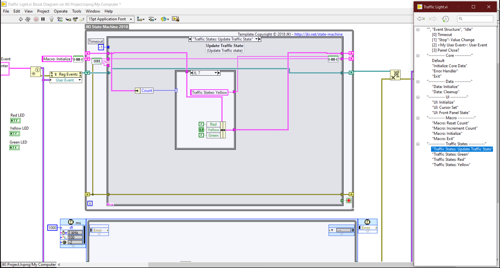
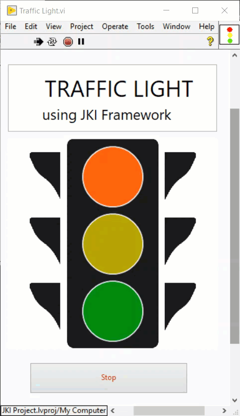

# JKI-Basic-Examples-By-Users
This is a repository for adding JKI examples made by JKI learners. Contribution is always welcome from all contributors.

## Examples List

 ### Traffic Light using State Machine (By [Waleed El-Badry](https://github.com/wbadry))
This is an intermediate level example showing how to use JKI State Machine for sequencing traffic light control.
It is composed of two concurrent loops

 - **Timed loop** : for generating user event every 1 second State Machine
  - **State Machine loop**: For carrying the sequential states of the traffic light based
   on the current count.

The sequence count is :
3 Seconds (**Red**) --> 2 Seconds (**Yellow**) --> 5 Seconds (**Green**)

